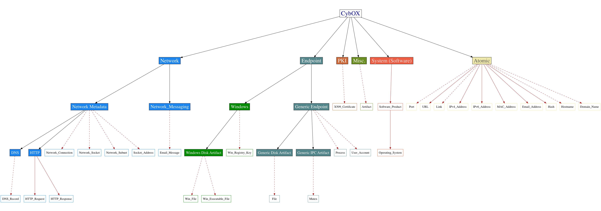

### Goals

* Simplification
* Elimination of ambiguity
    * Having only one way of representing specific entities
* Refactoring of CybOX Objects for accuracy, consistency, and to align with above goals

### Proposed High-level Changes (CybOX Core/Common)

These changes are likely to have the **greatest** impact, because they touch upon core CybOX structures.

#### Separation of Patterns and Instances
Currently, a CybOX Observable, in combination with an Object, can define either an observed instance of some data (e.g., a file), or a pattern for *detecting* some data. While this duality has its uses and benefits, particularly in terms of reducing schema complexity (i.e. essentially the same schema structures can be used for capturing both instances and patterns), it has a number of drawbacks, discussed [here](https://github.com/CybOXProject/schemas/issues/381).

We propose the separation of instances and patterns in CybOX Observables and Objects. This will have a number of benefits, including:

* It will clarify the issue of patterns vs. instances, as they will be captured in two separate locations, with their own distinct semantics
* It will allow for type and semantic-based data validation on ALL CybOX Object fields
    * This also supports the notion of atomic Objects, given that the ability to validate their data is one of their supporting elements
* It will allow for the creation of a domain-specific patterning language that facilitates the inclusion of more complex patterning constructs such as temporal patterning and variable based patterning

##### Domain-specific Patterning Language

This change would entail deprecating the existing patterning based structures in CybOX, and would require revisions to all CybOX Objects. It would also require the definition of a new patterning entity, that effectively functions as an implementation of a domain-specific patterning language.

There are currently some open questions around such a patterning language, including:

* How would this structure be tied to the CybOX Object model?
* Where would this structure live?
* What capabilities should this syntax have?

#### First-class Relationships

The current relationship structure in STIX and CybOX is difficult to use, owing to its entity-derived implementation. Having a first-class relationship structure (one that is shared between STIX and CybOX) will vastly simplify the creation and consumption of relationships. In CybOX, this would replace the existing relationship structures around:

* Objects
    * i.e., ObjectType/Related_Objects
* Actions
    * i.e., ActionType/Relationships

More discussion around this topic can be found in the [STIX Tracker](https://github.com/STIXProject/schemas/issues/291).

#### Cryptographic Hash Capture Refactoring

There are several issues around the current structure for capturing cryptographic hashes (the `HashType` from CybOX Common), the foremost of which is the inability to easily capture the most common types of hashes such as MD5, SHA1, etc. We propose refactoring this structure to make this easier, while still retaining the ability to capture less common or custom types of hashes. More information can be found in the proposal [here](https://github.com/CybOXProject/schemas/wiki/CybOX-3.0:-HashType-Refactoring).

### Proposed Object-related Changes

#### Object Refactoring for Semantic Accuracy
There currently exist several Objects with documented issues around semantic accuracy. Our goal is to refactor and fix these issues, for the Objects that fall into the set of "Core" CybOX Objects (defined below):

* File Object (and its derivatives)
* System Object
* Product Object

#### "Core" CybOX Objects
Refactoring the existing CybOX Objects (as needed) for semantic accuracy and consistency is a large undertaking, and so it might make sense to focus on the Objects that meet the 80% solution (or thereabouts) for CybOX 3.0. This entails refactoring the most commonly used Objects (for various use cases), as well as those that may provide a large amount of value. Future minor releases of CybOX (e.g., CybOX 3.1) could then be devoted to refactoring and also adding Objects specific to a particular subset or domain, such as network-centric Objects.

The diagram below ([graphviz source](cybox_object_categories_3.0_core.dot)) illustrates the Objects that we're currently considering for the "core" set. This selection was informed by the recent CybOX Object survey, as well as some of our own judgment. In this diagram, red lines denote new Objects (or significant refactoring of existing ones), and dashed lines denote Objects that would be subjects of potential refactoring. It is important to note that this is an initial set and likely to evolve and change (especially with respect to any new Objects) before the CybOX 3.0 release.

#### Expansion of "Atomic" Objects
There are currently several Objects, such as the Address Object, that are abstract in nature and attempt to encompass several more atomic Objects. It would be beneficial to break up these abstract Objects into their atomic components, which allow us to much more effectively constrain and therefore validate the data that is captured in the Object. It will also eliminate any potential for ambiguity in Object expression that exists today, such as an email address with an "address_type" value of "ipv4". 

##### Address Object Refactoring

Breaking up the Address Object into its components listed below will enable greater semantic accuracy and reduce ambiguity. See the proposal [here](https://github.com/CybOXProject/schemas/wiki/CybOX-3.0:-Address-Object-Refactoring) for more information.

* IP Address
    * IPv4 Address
    * IPv6 Address
* MAC Address 
* Email Address 

##### Other Objects

* URL [1]

[1] In conjunction with modification and potential deprecation of the existing URI Object.

